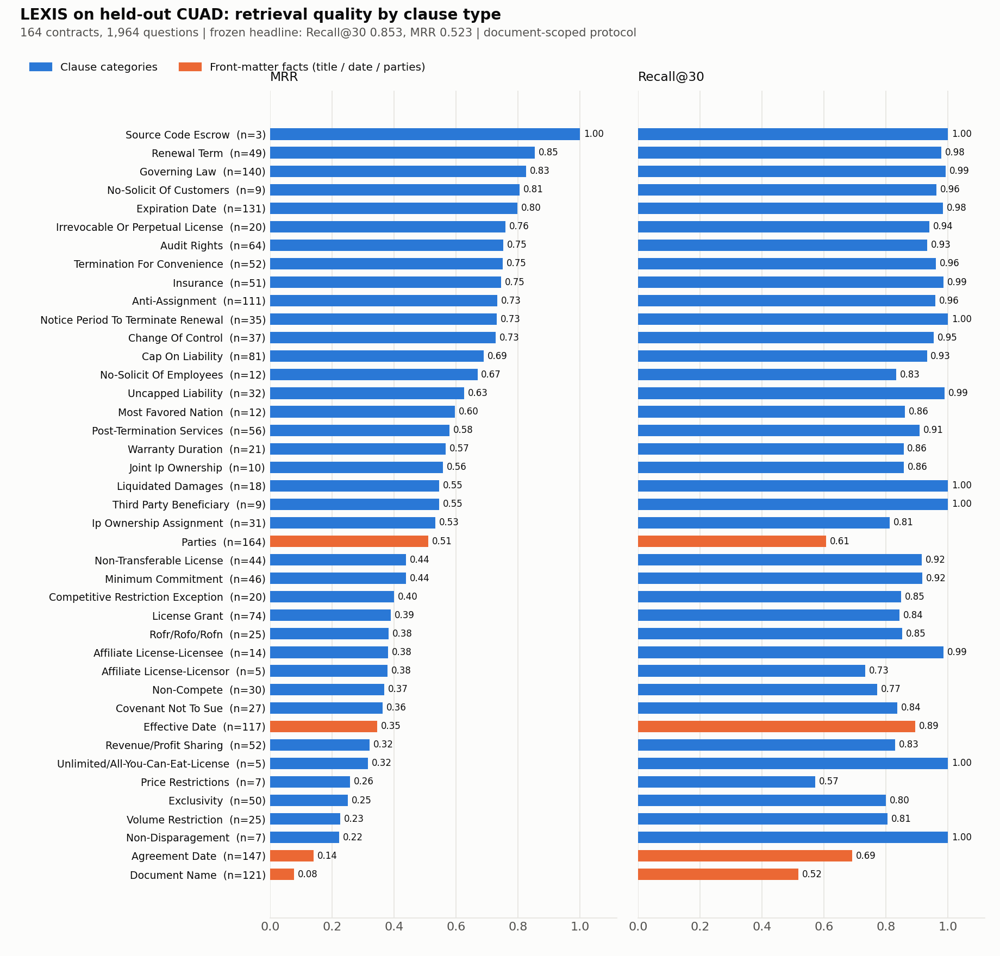
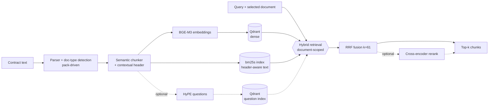

# LEXIS

A legal-document retrieval system built around **measurement first**: every claim below comes from a frozen,
held-out evaluation with confidence intervals, paired significance tests, and pinned provenance — including the
experiments that did *not* work.

## Headline result

Held-out test split of [CUAD](https://www.atticusprojectai.org/cuad) (**164 contracts, 1,964 scored questions**, never used
for development or tuning), document-scoped protocol, hybrid retrieval (dense BGE-M3 + BM25 fused with RRF):

| Metric | Value | 95% bootstrap CI |
|---|---|---|
| Recall@30 | **0.853** | [0.838, 0.867] |
| MRR | **0.523** | [0.505, 0.542] |

Frozen artifact: [`evaluation/reports/cuad_doc_scoped_test.json`](evaluation/reports/cuad_doc_scoped_test.json)
(per-case results, git SHA, config hash, data hashes, package versions, device).

**What "document-scoped" means.** Retrieval is restricted to the contract the question is asked about, supplied by the
task context (a user selecting a document), *never* chosen by the system. The whole-corpus ("pooled") protocol is kept as
a separate, frozen continuity baseline. See the next section for why they are not mixed.

### Where the quality comes from (and where it doesn't)



| Question group | n | Recall@30 [95% CI] | MRR [95% CI] |
|---|---|---|---|
| Clause questions (37 categories) | 1,415 | **0.923** [0.911, 0.935] | **0.617** [0.596, 0.638] |
| Front-matter facts: title, date, parties | 549 | 0.671 [0.636, 0.705] | 0.281 [0.252, 0.310] |

Governing Law (MRR 0.83), Renewal Term (0.86), Expiration Date (0.80), Termination for Convenience (0.75),
Audit Rights (0.75) and Insurance (0.75) are strong; `Document Name` (0.08) and `Agreement Date` (0.14) are the weakest.
Those ask for facts that live in a contract's header rather than in a clause, so clause-oriented chunking and
semantic matching are the wrong tool. The grouping above is a **post-hoc, descriptive** breakdown of the frozen test
results — it was not used to tune anything (the headline numbers are the frozen ones). Handling header facts is the
clearest next improvement. Reproduce the figure and table with `python scripts/make_results_report.py`
(post-processing only: no models, no network).

## What I found along the way

| Finding | Evidence | Status |
|---|---|---|
| Most retrieval misses with real queries come from the **wrong contract**, not poor ranking | 39 of 44 rank-1 misses (89%) on the dev diagnostic were chunks from a different document | measured |
| Knowing the document is the dominant lever | dev, paired: Recall@30 0.558 → 0.881, MRR 0.222 → 0.552, permutation p = 0.0008 | measured |
| **Automatic document routing does not work** here | rank-vote router picks the right document 20% of the time and makes Recall@30 *worse* (0.157); CUAD questions never name the contract | measured, negative result |
| An oracle MRR ceiling above 0.60 *is* reachable | case-level oracle MRR@30 = 0.907 [0.840, 0.963]; my earlier hypothesis that it wasn't was wrong and is corrected in the plan | measured |
| Query-side n-gram boilerplate reduction looked like a win but wasn't | Recall@30 +0.057 on n=50, only 5 cases changed, permutation p = 0.0625 (Holm 0.19) — not claimed | measured, not significant |

Dev numbers are on a deliberately small 10-contract / 50-question set used for iteration; they are labelled as such and
carry wide intervals. Only the test-split numbers above are headline results.

## Retrieval-improvement ladder (each rung = one config flag, measured against the frozen baseline)

| Rung | Change | Status |
|---|---|---|
| Document scoping (user-selected filter) | restrict retrieval to the chosen contract | **shipped and measured** (above) |
| R1 contextual chunk prefix for BM25 | BM25 now indexes the same "Document / Type / Section" header dense embeddings already used | **shipped**; dev n=50, replicated on a second machine (Colab T4) with near-identical numbers: MRR +0.026 [0.002, 0.058], Holm p = 0.16 (9 questions improved, 4 regressed), Recall@30 flat — *directionally positive, not statistically established at this sample size* |
| R2 HyPE (LLM-generated hypothetical questions) | index-time question generation, third RRF path | wired + tested (rate limiting, retry, daily-quota detection); **not measured** — the free-tier API key allows 20 requests/day, which cannot index even one small document's chunks |
| R4 cross-encoder rerank (`bge-reranker-v2-m3`) | rerank top-50 of the fused list | wired, tested, **measured on dev n=50 — inconclusive**: MRR 0.578 → 0.626 (+0.048, 95% CI [-0.065, +0.156], Holm p = 0.83), Recall@30 +0.004, rank-1 hits 21 → 25 of 50 (17 improved / 12 regressed). Same data hash and commit for both runs; only the flag differs. The interval is too wide to separate a real gain from noise — a larger dev sample is required before claiming anything |

A gain is only claimed when the paired bootstrap CI excludes zero **and** the permutation test passes after Holm
correction (`lexis.evaluation.stats.claim_supported`). Several rungs above do not clear that bar yet, and the table says so.

## How the evaluation is kept honest

- **Group-disjoint, hash-based dev/test split** frozen in `evaluation/splits/cuad_split_v1.json` (dev 346 / test 164
  contracts); the 10 contracts analysed during development are pinned to dev — three of them would otherwise have leaked
  into test.
- **Provenance on every artifact:** git SHA, resolved-config hash, input-data SHA-256, package versions, compute device;
  secrets are redacted.
- **Paired statistics, not bare deltas:** bootstrap CIs over queries, sign-flip permutation tests, Holm correction.
- **Measurement hygiene found the hard way:** first-query-after-ingest can differ from the settled state (a re-query
  "settle pass" is part of the protocol); GPU vs CPU embeddings shift results by a measurable, documented amount; a
  guarded retry stops silent dense-path timeouts from corrupting a run.
- **Zero-hardcoding ratchet:** an AST-based lint (`python -m lexis.quality.hardcode_lint`) blocks new hardcoded model
  names, URLs, tunable numbers and classification tables; the violation count (currently 115) may only go down, and the
  baseline is enforced by a unit test and CI. Jurisdiction-specific vocabulary lives in YAML packs (`config/packs/`), model choices in a licence-aware
  registry (`config/models.yaml`).
- **623 unit tests**, including a test that audits every import against declared dependencies (it exists because a fresh
  Colab install exposed five undeclared ones).

## Architecture



Key design choices: hybrid dense+lexical retrieval fused with parameter-free RRF; BM25 over a local index (no search
cluster to operate); cloud vector store with payload filtering on `doc_id` for scoping; every experimental component
behind a flag that defaults off so frozen baselines cannot change by accident.

## Reproduce

```bash
pip install -e ".[dev]"
python -m pytest tests/unit -q                 # 623 tests
python -m lexis.quality.hardcode_lint          # zero-hardcoding ratchet
python scripts/make_results_report.py          # figure + per-category stats from the frozen result
python -m lexis.evaluation.run_gate_check --help
```

Re-running the benchmark itself needs Qdrant, Postgres and a GPU for reasonable speed — it is packaged as a Colab
notebook pinned to an exact commit: `notebooks/cuad_doc_scoped_test_baseline.ipynb` (Stage A sanity check, Stage B held-out
run, Stage C freeze). Design decisions are recorded in `docs/ADR.md`.

## Status and honest limitations

- **Jurisdictions:** the pack framework (citation grammars validated against their own examples, BM25 config, chunking
  policy, prompts, compliance flags) is built and tested, with US-contracts, India, and UK/EU packs defined. Only the
  US-contracts path has been **evaluated**; the others are configuration, not measured results.
- **Faithfulness checking:** a real NLI entailment checker (DeBERTa-v3, label order read from the model config) replaced
  a stub that always returned `True`. Its threshold is **uncalibrated** — a hand-labelled legal claim set is still needed
  before quoting any accuracy.
- **Not yet production-validated:** the API/serving layer, deep-mode agent loop, frontend, auth and rate limiting have not
  been load-tested or deployed; do not read the retrieval results above as a statement about end-to-end serving.
- **Front-matter facts** (title, date, parties) are weak (see above).
- **Scope of claims:** English-language US commercial contracts; one benchmark (CUAD); the document-scoped protocol assumes
  the user supplies the document.
